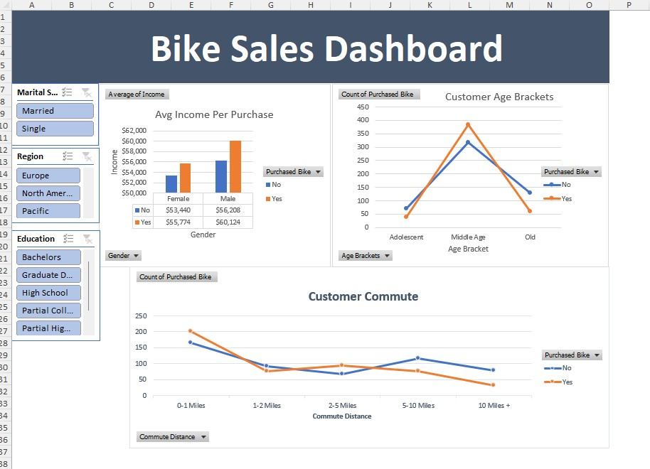

# 🚲 Bike Sales Data Analysis (Excel Dashboard)

## 📌 Project Overview
This project analyzes customer demographics to identify patterns related to bike purchases.  
Using Microsoft Excel, I created pivot table analyses and an interactive dashboard for customer segmentation.

---

## 🗂 Repository Structure
bike-sales-excel-analysis/
 data/
 bike_buyers_raw.xlsx
 dashboard/
 bike_sales_dashboard.xlsx
images/
 dashboard_preview.jpg
README.md

---

## 📊 Dashboard Highlights
- Avg Income Per Purchase (Yes vs No)
- Customer Age Brackets (buyers vs non-buyers)
- Customer Commute Distance analysis
- Interactive filters (Slicers):
  - Marital Status
  - Region
  - Education

---

## 🛠 Tools Used
- Microsoft Excel
- Pivot Tables
- Charts
- Slicers
- Dashboard Design

---

## 📸 Dashboard Preview

